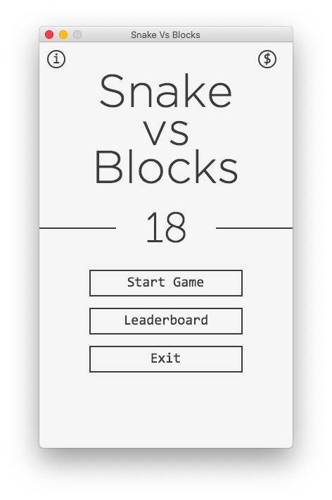
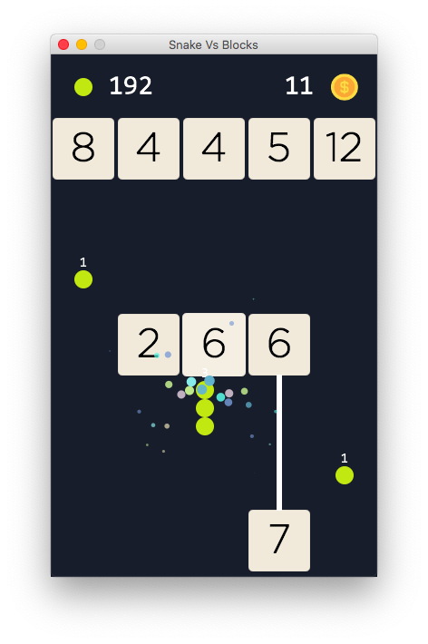
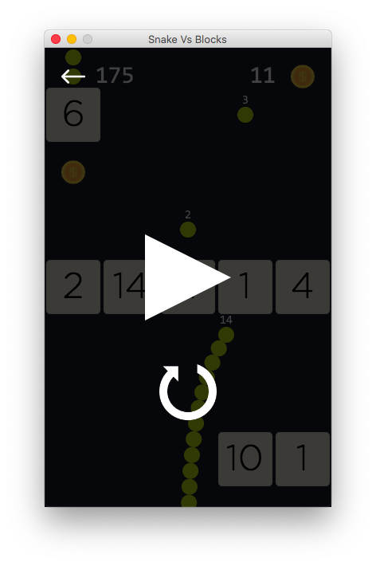
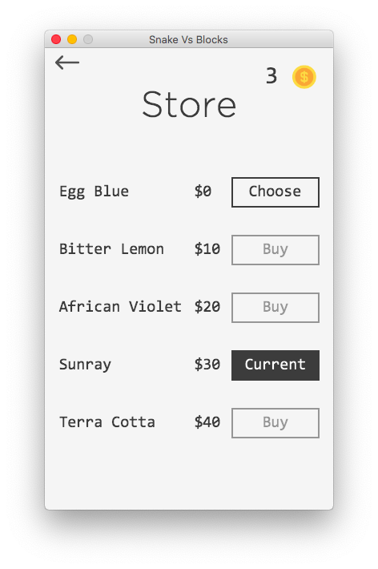

# Snake Vs Blocks

Clone of the famous Snake VS Blocks game, made purely in JavaFX Canvas. Watch a 1 minute [gameplay](https://www.youtube.com/watch?v=CPC02BDkRFw&feature=youtu.be).

Menu                       | In Game                   | Pause                     | Store
:-------------------------:|:-------------------------:|:-------------------------:|:-------------------------:
   |   |   | 

## Features
- Pause your game and never let anything hold you to score a highscore!
- Save your progress by hitting the pause button.
- Change your snake color by purchasing skins from the store using in-game collected coins.
- View top ten scores in the Leaderboard.
- Rare special powerup to send you into ultimate nirvana!
- Smooth animations and modern UI.

## Installation
This game requires Oracle's Java Runtime Environment (JRE) 1.8 which can be downloaded for free from their [website](https://www.oracle.com/technetwork/java/javase/downloads/jre8-downloads-2133155.html).  

1. Download jar file from [here](https://github.com/vermaditya1999/Snake-Vs-Blocks/raw/master/out/artifacts/Snake_Vs_Blocks/Snake_Vs_Blocks.jar).  
2. Run the game: `java -jar Snake_Vs_Blocks.jar`.  

If you want to build it yourself, then you need to copy the contents of `/src/main/resources` to `/src/main/java/` and compile `Main.java` from directory `/src/main/java`.

## Info
This project is part of course CSE201: Advanced Programming at IIIT-Delhi.
